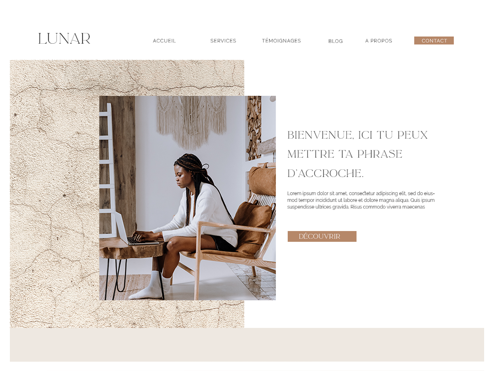

# Lunar, un thème WordPress :first_quarter_moon_with_face:

Lunar est un thème sur-mesure basé sur le coeur de WordPress, c'est un thème natif. Créé avec les boucles natives de WP, en utilisant Gutenberg le module de WP pour la mise en page. 
J'ai créé ce thème avec en complément le plugin Lunar-blocks qui ajoute des modules de mise en page à Gutenberg. 

:point_right: Projet débuté en novembre 2020, toujours en cours de réalisation début 2021

## Installation

Téléverser le fichier .zip du thème Lunar, dans la section thèmes de WordPress.

## Réalisation :construction_worker:

Basé sur un starter thème : [underscore](https://underscores.me/), Lunar est un thème simple et élégant. 

## Compétences :roller_coaster:
Formée en JavaScript, j'ai relevé le défi d'approcher le développement de WordPress avec Php.:elephant: 
Une avancée en autodidacte, j'ai beaucoup appris via [Capitaine WP](https://capitainewp.io/) et ses cours très complets. 

## License :moon:
Projet réalisé pour [Design on the Moon](https://www.design-onthemoon.com/)